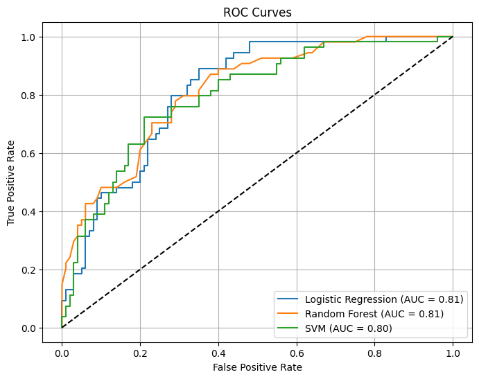
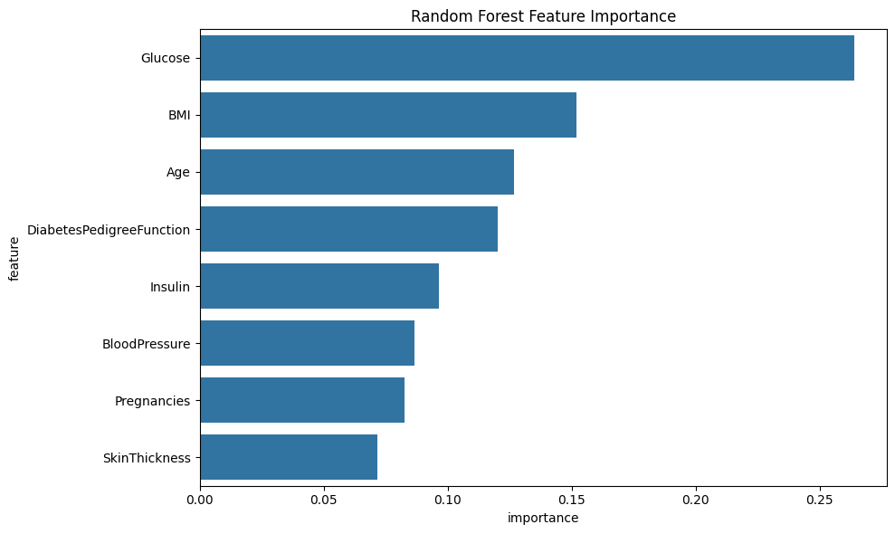
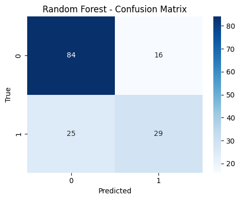
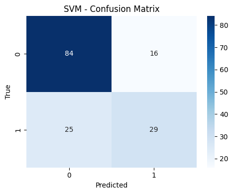
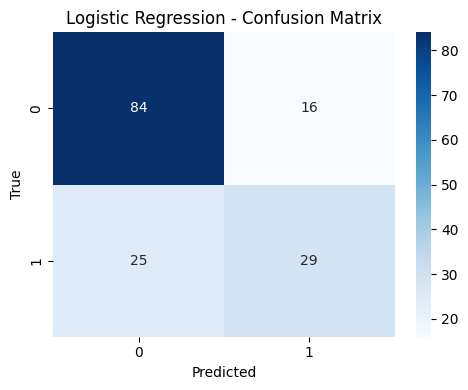

# Diabetes Prediction using Machine Learning

 # 📌 Project Overview
This project applies machine learning techniques to predict diabetes risk in patients based on medical and lifestyle data. **Using the Pima Indians Diabetes Database**, I developed and compared three classification models to identify individuals at higher risk, achieving **77.9% accuracy** with Random Forest.

**Key Skills Demonstrated:**

- Data cleaning & preprocessing with missing value imputation
- Exploratory Data Analysis (EDA) with statistical visualizations
- Machine learning model development & hyperparameter tuning
- Feature importance analysis for healthcare insights
- Model evaluation using ROC-AUC, precision, recall, and F1-score

## Objective
- Develop a predictive model to identify individuals at higher risk of diabetes.
- Compare multiple algorithms and select the best-performing model.
- Present results through visualisations and feature importance analysis.

## Dataset
Source: [Pima Indians Diabetes Database](https://www.kaggle.com/datasets/uciml/pima-indians-diabetes-database)  

**Dataset Characteristics:**

- **768 patient records** (female patients of Pima Indian heritage, ages 21+)
- **8 predictive features:**

   - **Pregnancies:** Number of times pregnant
   - **Glucose:** Plasma glucose concentration (mg/dL)
   - **Blood Pressure:** Diastolic blood pressure (mm Hg)
   - **Skin Thickness:** Triceps skinfold thickness (mm)
   - **Insulin:** 2-hour serum insulin (mu U/ml)
   - **BMI:** Body mass index (weight in kg/(height in m)²)
   - **Diabetes** Pedigree Function: Genetic diabetes likelihood score
   - **Age:** Patient age (years)


- **Target Variable:** Binary classification

   - 1 = Diabetic
   - 0 = Non-diabetic


- **Class Distribution:**

   - 268 diabetic cases (34.9%)
   - 500 non-diabetic cases (65.1%)

## Methods
1. **Data Preprocessing**
   - Addressed missing values and zero entries in essential health indicators.
   - Scaled numerical features to ensure model compatibility.
2. **EDA & Visualisation**
   - Identified associations between features and diabetes outcome.
   - Demonstrated key trends using histograms, pair plots, and distribution charts.
3. **Model Development**
   - Performed Logistic Regression, Decision Tree, Random Forest, and Support Vector Machine (SVM).
   - Used **AUC-ROC** and **F1-score** to compare models.
4. **Feature Selection**
   - Employed feature importance analysis to determine the most relevant predictors.
   - Reduced less significant features to improve model efficiency and interpretability.
5. **Evaluation**
   -  Random Forest was determined as the best model.

## Results
- Random Forest achieved **77.9% accuracy** and **AUC-ROC: 0.8191**
- Feature importance analysis revealed Glucose, BMI, and Age as top predictors

## Key Visualisation
  
*Random Forest achieved the highest area under the curve.*

  
*Most influential features driving predictions.*

##  Model Confusion Matrices
Below are the confusion matrices for the top models tested:

**Random Forest (Best Performing Model)**  


**Support Vector Machine (SVM)**  


**Logistic Regression**  



## Tools & Libraries
- **Languages:** Python 
- **Libraries:** Pandas, NumPy, Scikit-learn, Matplotlib, Seaborn  
- **Environment:** Google Colab / Jupyter Notebook

## How to Run
1. Clone the repository:
```bash
git clone https://github.com/Samson-tech-code/diabetes-prediction-ml.git
pip install pandas numpy scikit-learn matplotlib seaborn
